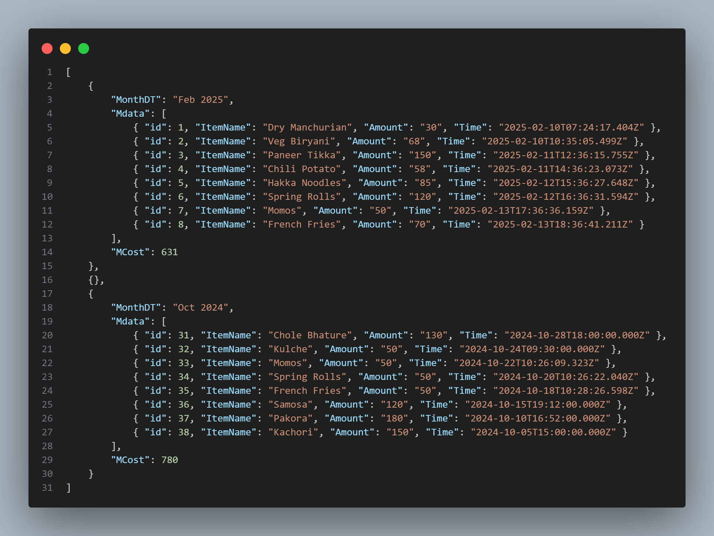
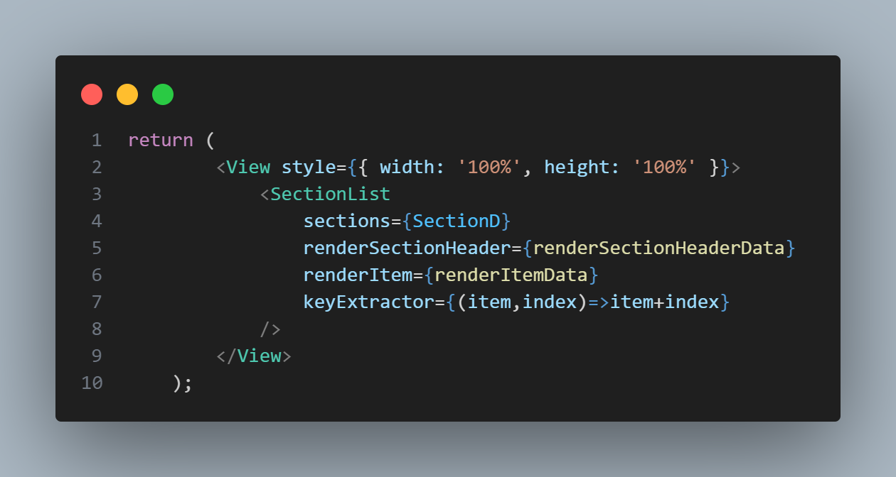
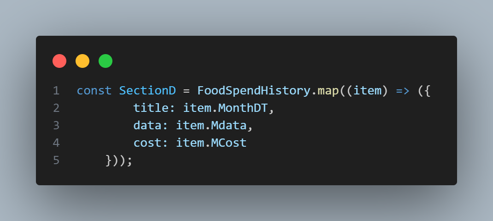
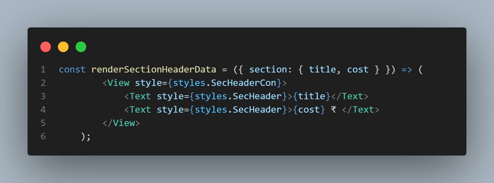
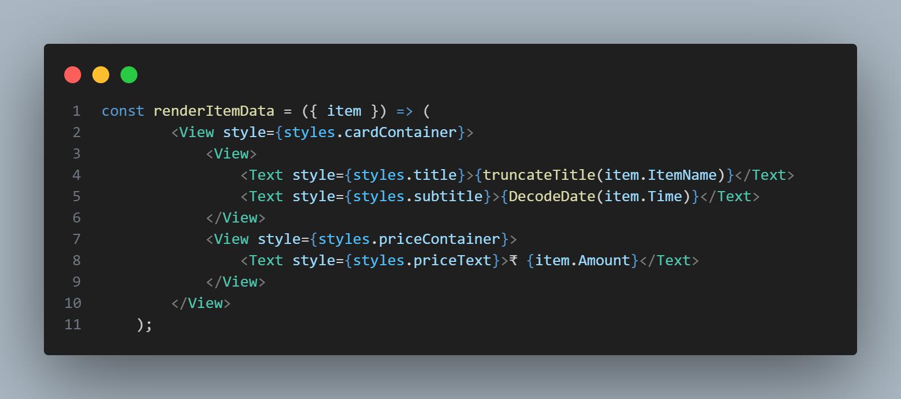
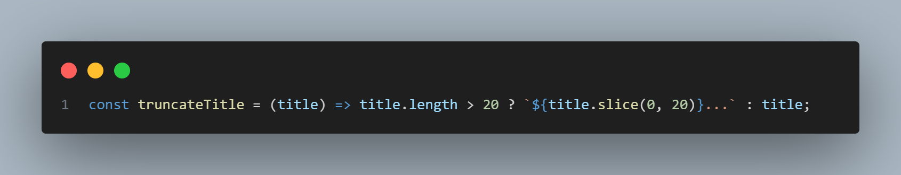
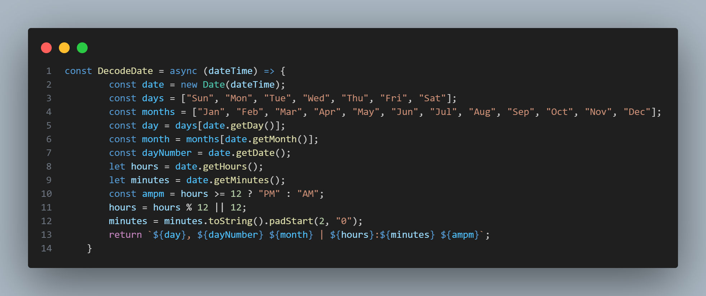

# React Native SectionList Implementation

Hello, guys!  
My name is Aadil, and I am a Mobile Application Developer. In this repository, I have implemented a **React Native SectionList**, which efficiently displays and organizes large data sets into collapsible sections. Below, you will find the full explanation, and the source code is available in this repository. The repository contains:
- **FoodHistoryArrayObject.json** – A dummy array of food transaction data
- **SectionListDisplay.js** – The full implementation of the SectionList

Let's get started!
## What is SectionList and Why is it Required?

A **SectionList** is a component in React Native that helps you to display a list of data with multiple sections. It is ideal for rendering data that can be grouped into different categories. SectionList displays each section with a header and collapsible/expandable content under it.

### Benefits of Using SectionList:
- Efficient rendering of large data sets
- Ability to display data in sections, making it more organized
- Built-in support for rendering headers for each section
- No need for external libraries (SectionList is an inbuilt React Native component)
 
 
 
## Screen Recording:
[](Images/SectionListScreenRecord.mp4)


As you can see, I have used Google’s transaction history as a reference and created a dummy data set. The SectionList displays the transactions by month, showing the **total amount** for each month in the header. The items inside each section display the **food name**, **amount**, **date**, and **time**.

## Code Explanation:

In the code, I created a **dummy array object** that contains information about months, items, and their corresponding total amounts.


### React Native SectionList Implementation:
To use the SectionList in React Native, we use the built-in `<SectionList>` component, so there is no need for any external library.



As shown in the image, I’ve broken down the code step-by-step using:
```jsx
sections={SectionD} 
renderSectionHeader={renderSectionHeaderData} 
renderItem={renderItemData}
```
<br/>

## Let's Dive into Each of These:
### 1. SectionD – Formatted Array:
In `SectionD`, I filtered and formatted the array to match the required structure. This array is now ready to be used in the **SectionList** component.



<br/>

### 2. renderSectionHeaderData – Section Header:
This function defines how each section header will look. In this case, it shows the **month** and the **total amount** for that month.



<br/>

### 3. renderItemData – Rendering Items:
This function renders each item in the section. It displays:
- **Item Name**
- **Time**
- **Amount**
  
Additionally, I used:
- `truncateTitle(item.ItemName)` to ensure that the **title length** does not exceed 20 characters, truncating longer titles.
- `DecodeDate(item.Time)` to convert the time from ISO format to a more readable format, such as **Fri 14 Feb | 12:06 AM**.


<br/>

### 4. truncateTitle – Truncating Titles:
This function ensures that the item name does not exceed 20 characters. If the title is too long, it gets sliced.



<br/>

### 5. DecodeDate – Decoding Date and Time:
This function decodes the datetime (e.g., `2025-02-13T18:36:41.211Z`) and formats it into a human-readable format like **Fri 14 Feb | 12:06 AM**.



---

### Conclusion:
This is how we can implement the **SectionList** in React Native to display a grouped list of items with section headers. It’s an efficient and clean way to organize large data sets, making them easy to read and interact with.

Feel free to explore the code in the repository and make any improvements or modifications as per your needs.

---

### Additional Resources:
- [React Native SectionList Documentation](https://reactnative.dev/docs/sectionlist)
- [React Native Official Website](https://reactnative.dev)

